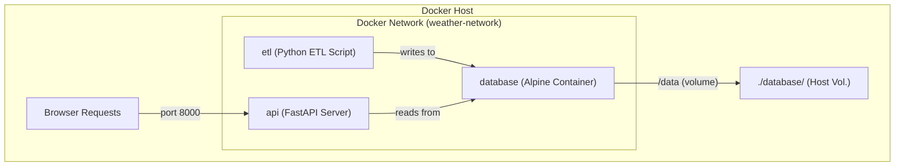

# 🐳 DOCKER DEPLOYMENT GUIDE

---

## 📋 TABLE OF CONTENTS

1. [Docker Setup Overview](#1-docker-setup-overview)
2. [Building Images](#2-building-images)
3. [Running Containers](#3-running-containers)
4. [Service Management](#4-service-management)
5. [Troubleshooting](#5-troubleshooting)
6. [Production Deployment](#6-production-deployment)

---

## 1. DOCKER SETUP OVERVIEW

### Docker Architecture



### Services

| Service | Image | Purpose | Key Config |
| :--- | :--- | :--- | :--- |
| **DATABASE** | `alpine:latest` | Maintains database directory | Volume: `./database` → `/data` |
| **ETL** | `weather-etl` | Runs ETL pipeline | Command: `python main.py --stations 24 25 26 --limit 100` |
| **API** | `weather-api` | REST API server | Port: `8000:8000`, Health: `/health` |

### Key Files
- `Dockerfile`: Defines Python image with dependencies.
- `docker-compose.yml`: Orchestrates all services.
- `.dockerignore`: Files to exclude from image.
- `.env`: Environment variables (optional).

---

## 2. BUILDING IMAGES

### Build Commands
```bash
# Build all services
docker compose build

# Build specific service
docker compose build api

# Build without cache (clean build)
docker compose build --no-cache

# Pull latest base images first
docker compose pull
docker compose build
```

### Build Process
1. Pull base image (`python:3.11-slim`)
2. Install system dependencies (`gcc`, `curl`)
3. Install Python packages from `requirements.txt`
4. Copy application code & create database directory
5. Create non-root user (`appuser`) & set permissions
6. Configure health check

---

## 3. RUNNING CONTAINERS

### Start Services
```bash
# Start all services in background
docker compose up -d

# Start with logs (foreground)
docker compose up

# Start and rebuild if needed
docker compose up -d --build
```

### Check Status
```bash
# Show running containers
docker compose ps

# Expected output:
# NAME              STATUS                PORTS
# weather-api       Up (healthy)          0.0.0.0:8000->8000/tcp
# weather-database  Up (healthy)
# weather-etl       Exited (0)
```

### View Logs
```bash
# Follow logs (real-time)
docker compose logs -f

# Logs for specific service
docker compose logs api
```

---

## 4. SERVICE MANAGEMENT

### Stop Services
```bash
# Stop all services
docker compose stop

# Stop and remove containers
docker compose down

# Stop and remove containers + volumes
docker compose down -v
```

### Execute Commands in Container
```bash
# Open bash shell in API container
docker exec -it weather-api bash

# Check database file from inside
docker exec weather-api ls -lh /app/database/
```

### Health Checks
```bash
# Check health status
docker inspect weather-api --format='{{.State.Health.Status}}'
# Expected: healthy
```

---

## 5. TROUBLESHOOTING

| Problem | Diagnosis/Solution |
| :--- | :--- |
| **Container Exits Immediately** | Check logs: `docker compose logs api`. Test imports: `docker exec weather-api python -c "import src.api.main"`. |
| **Port Already in Use** | Find process: `lsof -i :8000` (Mac/Linux) or `netstat -ano \| findstr :8000` (Win). Change port in `docker-compose.yml`. |
| **Database Empty** | Check ETL logs: `docker compose logs etl`. Run manually: `docker compose run --rm etl python main.py --stations 24 25`. |
| **Health Check Failing** | Test manually: `docker exec weather-api curl -f http://localhost:8000/health`. Increase `start_period` in compose file. |
| **Out of Disk Space** | Run cleanup: `docker system prune -a --volumes`. |

---

## 6. PRODUCTION DEPLOYMENT

### Pre-Deployment Checklist
- [ ] Remove `--reload` from uvicorn command.
- [ ] Use PostgreSQL instead of SQLite.
- [ ] Set up reverse proxy (Nginx) and enable HTTPS.
- [ ] Set resource limits (CPUs, Memory) in `docker-compose.yml`.
- [ ] Enable automatic restarts (`restart: always`).

### Production Compose Example
```yaml
services:
  api:
    build: .
    restart: always
    command: uvicorn src.api.main:app --host 0.0.0.0 --port 8000 --workers 4
    deploy:
      resources:
        limits:
          cpus: '2'
          memory: 1G
```

---

## USEFUL COMMANDS REFERENCE

| Command | Description |
| :--- | :--- |
| `docker compose build` | Build all images |
| `docker compose up -d` | Start services in background |
| `docker compose down -v` | Remove containers and volumes |
| `docker system prune -a` | Remove everything unused |
| `docker compose run --rm api pytest` | Run tests in container |

---

**For more information, see:**
- [README.md](README.md)
- [USER_GUIDE.md](USER_GUIDE.md)
- [INSTALLATION_GUIDE.md](INSTALLATION_GUIDE.md)
